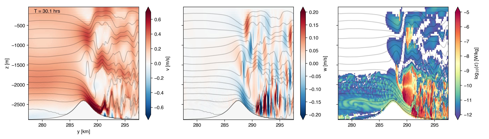

Barotropic Flow Across Bump
===========================

This repository contains setup files and analysis of a number of 2D mitgcm simulations of flow across a ridge/bump.

B3
--
Velocity 0.02m/s, bump height H=500m and stratification N=1e-3s^-1. Hydrostatic.
[video](https://vimeo.com/200936563)

B5
--
Velocity 0.2m/s, bump height H=500m, stratification N=1e-3s^-1. Hydrostatic
[video](https://vimeo.com/200271655)

B6
--
Same setup as B5 but non-hydrostatic.
[video](https://vimeo.com/200374154)